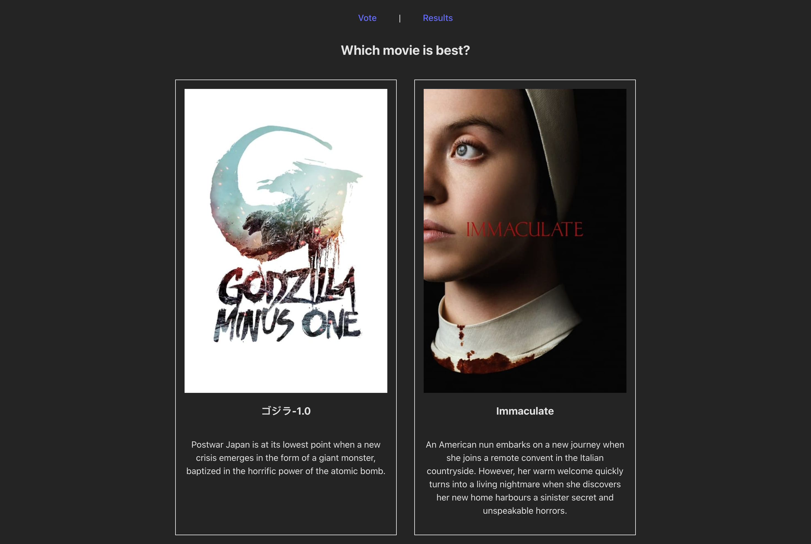
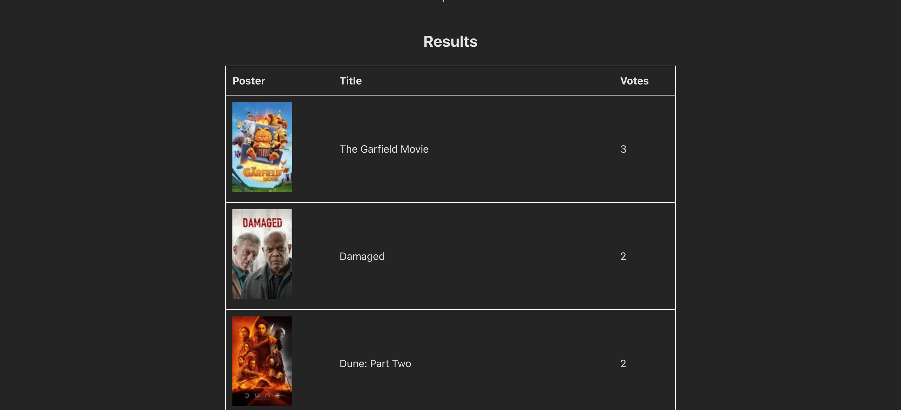

# To Watch

Suggest movies for me to watch by picking between two options.

## Setup

```
npm install
cp .env.example .env
node api/app.js
npm run dev
```

Get key from [moviedb](https://www.themoviedb.org/?language=en-GH)
Get mongodb atlas link from the [dashboard]()

## Screenshots

Main Page



Results Page


